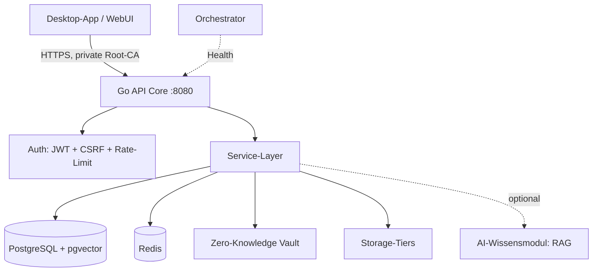

# NAS.AI — Secure Self-Hosted NAS

[](https://go.dev/)
[](https://reactjs.org/)
[](LICENSE)

**Sicheres, selbst-gehostetes NAS-System mit Zero-Knowledge-Verschlüsselung, eigener PKI und einem gehärteten Go-Backend.**

Ausgelegt für den Betrieb im eigenen LAN (Raspberry Pi 5) — mit dem Anspruch, es sicherheitstechnisch besser zu machen als typische Consumer-NAS: kein Zwang zu Hersteller-Cloud, keine ins Internet exponierte Weboberfläche, echte Zero-Knowledge-Verschlüsselung.

---

## 🏗 Architektur



**Aktueller Betriebsmodus:** Backend-only Stack — **API + PostgreSQL + Redis**. WebUI, das AI-Wissensmodul und der Orchestrator sind eigenständige, optionale Komponenten (siehe unten).

---

## ✨ Kernpunkte

- **🔒 Zero-Knowledge-Vault** — XChaCha20-Poly1305 (AEAD) mit Argon2id-Schlüsselableitung. Schlüsselhierarchie Master-Passwort → KEK → DEK; der DEK liegt ausschließlich im RAM und wird bei Neustart neu entsperrt. Der Server sieht Klartext nie.
- **🛡 Eigene PKI statt Warnungen** — private Root-CA + serverseitiges Zertifikat; Clients validieren gegen die eingebettete CA (kein TOFU, kein „Zertifikat ungültig").
- **🧱 Defense-in-Depth** — API-Container läuft entprivilegiert (`nobody`, `cap_drop: ALL`), lauscht nur auf der LAN-IPv4, kein Port-Forwarding; Host mit Firewall-Whitelist, SSH key-only und automatischen Sicherheitsupdates.
- **⚡ Go-Backend** — schlanke, getestete REST-API mit Redis-gestützten Job-Queues; PostgreSQL mit `pgvector`.
- **🧠 AI-Wissensmodul (optional/experimentell)** — lokale RAG-Wissensdatenbank (semantische Suche via `pgvector`). Vollständig im Code vorhanden, aktuell **deaktiviert**; lässt sich als eigenständiges Modul zuschalten.

---

## 🔐 Sicherheits-Design (Kurzüberblick)

| Bereich | Umsetzung |
|---|---|
| Verschlüsselung | XChaCha20-Poly1305 + Argon2id, DEK nur im RAM |
| Transport | Private Root-CA, produktives TLS, LAN-IPv4-Binding |
| Container | `nobody`, `no-new-privileges`, `cap_drop: ALL` |
| Auth | JWT (Access/Refresh), CSRF (Double-Submit), Rate-Limiting |
| Host | Firewall-Whitelist, SSH key-only, unattended-upgrades |
| Datenklasse | Trennung öffentlich vs. Vault; der Vault ist für Automatisierung/Agenten tabu |

---

## 🚀 Quick Start

Backend-Stack (API + PostgreSQL + Redis) via Docker Compose:

```bash
git clone https://github.com/user06/NasServer.git
cd NasServer/infrastructure
docker compose -f docker-compose.pi.yml --env-file .env.pi up -d postgres redis api
```

Konfiguration über `.env` (Secrets werden nie eingecheckt — siehe `.env.template`).

---

## 🧩 Optionale Komponenten

- **WebUI** (`infrastructure/webui`) — React-Dashboard (Glassmorphism-UI).
- **AI-Wissensmodul** (`infrastructure/ai_knowledge_agent`) — Python-Service für Embeddings/RAG; derzeit deaktiviert.
- **Orchestrator** (`orchestrator`) — Health-Monitoring & Metriken.

---

## 📚 Dokumentation

- [**Architektur & Entwicklung**](./ARCHITECTURE.md)
- [**Backend-API**](./infrastructure/api/README.md)
- [**Security-Handbuch**](./docs/security/SECURITY_HANDBOOK.md)
- [**Developer Guide**](./docs/development/DEV_GUIDE.md)

---

## 🛠 Entwicklung

Solo-Projekt. Implementierung, Code-Review und Dokumentation entstanden im Zusammenspiel mit KI-gestützten Entwicklungswerkzeugen (LLM-Pair-Programming) — Architektur- und Sicherheitsentscheidungen sowie die finale Verantwortung liegen beim Autor.
